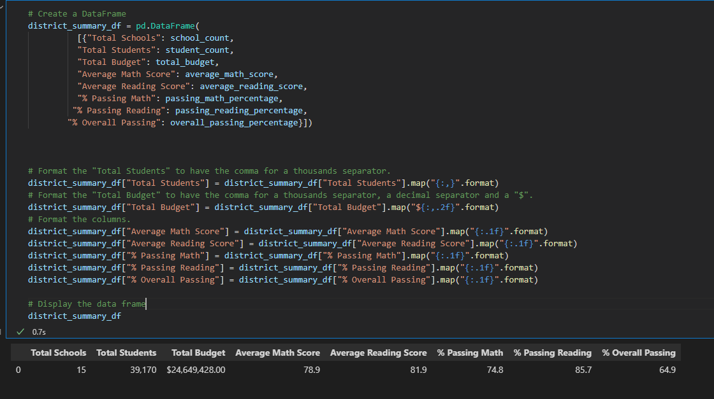

# School_District_Analysis

## Project Overview

The school board has notified us that the source data shows evidence of academic disonesty; specifically, reading and math grades for Thomas High School ninth graders appear to have been altered. Although the school board dooes not know the full extent of the academic dishonesty, they want to uphold state-testing standards and have turned to us for help. We are to replace the math and reading scores for Thomas High School with 'NaNs' while keeping the rest of the data intact. Once the math and reading scores have been replaced, repeat the analysis and describe how the changes affected the overall analysis.

## Resources
- Data source: students_complete.csv
- software: Python 3.7.9, VS Code 1.65.2, conda 4.12.0

## Results

### How is the district summary affected?

The initial step to the analysis is to erase the scores for Thomas High grade 9 students:

The result of the change has slightly change as 461 students that were taken out from the dataset only is a small portion of the whole data population.
	- For the analysis, the 'Total Students' has still been set to 39,170 instead of 38,709 (adjusted).
		

### How is the school summary affected?

Looking at the Per school summary, we see that in the original summary the average math score for Thomas High is 83.350937, average reading score is 83.896082, % Passing Math is 66.911315, % Passing Reading is 69.663609, and % Overall Passing is 65.076453.

 
Once the adjustment has been applied, we see that the scores for % Passing Math, % Passing Reading and % Overall Passing has increased significantly.

### How does replacing the ninth graders’ math and reading scores affect Thomas High School’s performance relative to the other schools?

In the adjusted scores, we see that Thomas High school is now ranked 2nd in % overall passing:

### How does replacing the ninth-grade scores affect the following:
#### Math and Reading scores by grade:

Math Scores:

Reading Scores:

#### Scores by school spending:

Thomas High School falls in the $630-$644/student spending range.

#### Scores by school size:

Thomas High School is classified as a medium-sized school.

#### Scores by school type:

Thomas High School is a charter school type.

## Summary

1. The overall passing rate for Thomas High School is changed from 65.07% to 90.63%, which placed them from 8th to 2nd in ranking.

2. Due to academic dishonesty, the data for the 9th grade students in Thomas High school has been adjusted to 'NaN'

3. In addition, the % passing math and % passing reading saw some shifts due to the adjustments.

4. In a larger picture, this does not affect the district scores as much. 

